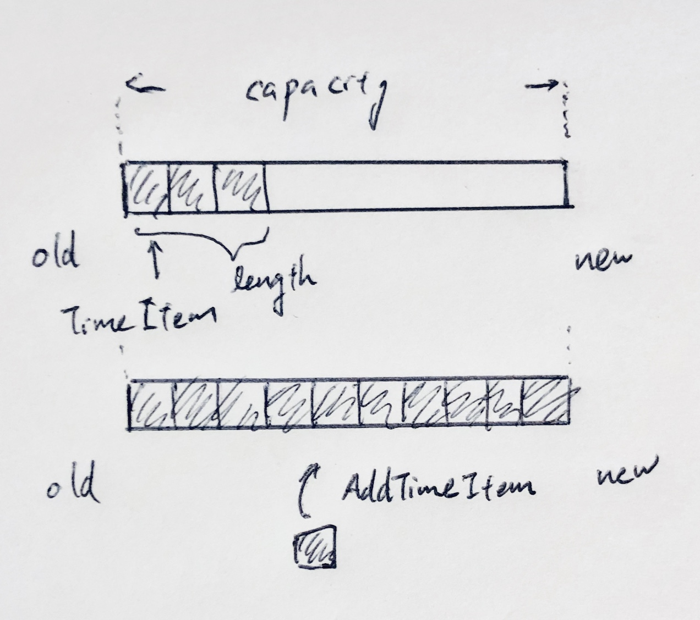

# time-sorted-list

[](https://circleci.com/gh/go-zen-chu/time-sorted-list)
[](https://goreportcard.com/report/https://godoc.org/github.com/go-zen-chu/time-sorted-list)
[](http://godoc.org/https://godoc.org/github.com/go-zen-chu/time-sorted-list)
[](https://https://godoc.org/github.com/go-zen-chu/time-sorted-list/issues)

Time sorted list in Golang.

## What this data structure for?

- in memory time series data store
- any data sorted in time series
- query data using from or until in unixtime

and requires only standard package

## Structure



### Searching data through unixtime

Since this data structure intented to store time series data, it has abilty to search item via unix time.

```
timeItems := tsl.GetItemsFrom(unixTime)
timeItems := tsl.GetItemsUntil(unixTime)
```

### Add item

When you add item, it will automatically sort

```
tsl.AddItem(unixTime, timeItem)
```

## Background

When we handle time series data, we need something like a sorted list (In Golang, by implementing sort.Interface we can do this).

Most of cases, we need not only storing data in time sequence but also querying data by time.

This data structure is intented to handle such cases.

## On going
- User can decide which item (old or new) should be dropped if list is filled

## Test

We use ginkgo for testing

```
$ ginkgo -r -v .

••••••••••••••••••••
Ran 20 of 20 Specs in 0.002 seconds
SUCCESS! -- 20 Passed | 0 Failed | 0 Pending | 0 Skipped
PASS
coverage: 100.0% of statements
```
